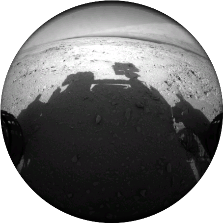
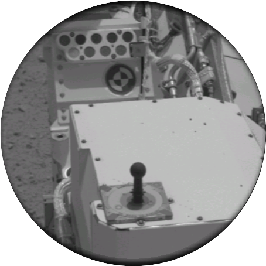
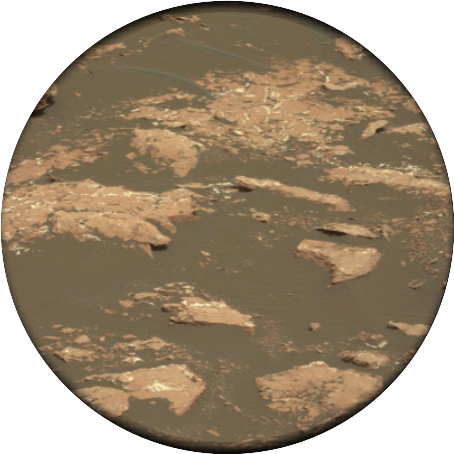
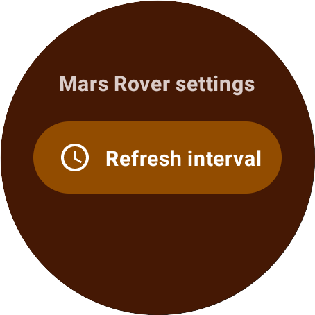
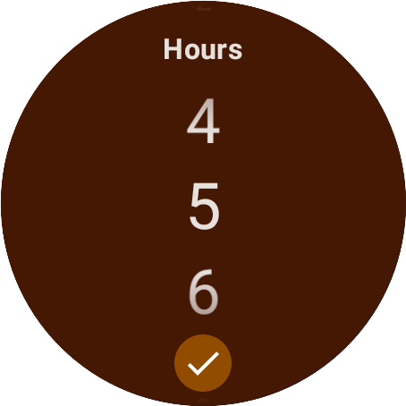

# WearOS app to view Mars Rover photos

This is a WearOS app that displays random photos from the three Mars rovers *Curiosity*,
*Opportunity*, and *Spirit* taken on the Mars in
a [WearOS tile](https://developer.android.com/training/wearables/tiles).

This project uses the [NASA API](https://api.nasa.gov/index.html#browseAPI) _Mars Rover Photos_.

Tile:

  

App:

 

## Structure

The project is structured into two different main folders:

* `tile` - contains all code to provide
  a [tile](https://developer.android.com/training/wearables/tiles), which displays the Mars images.
* `app` - contains all code for networking, business logic and UI for the
  supporting [WearOS app](https://developer.android.com/training/wearables/apps).

By default, a new image is loaded every 24 hours and the task is scheduled via
[Android WorkManager](https://developer.android.com/guide/background/persistent). The interval
can be changed using the WearOS app, which uses Jetpack Compose with specific WearOS components.

## Libraries

### UI

- [Jetpack Compose for WearOS](https://developer.android.com/training/wearables/compose)
- [Compose navigation for WearOS](https://developer.android.com/training/wearables/compose/navigation)
- [Horologist](https://github.com/google/horologist)
- [Coil](https://github.com/coil-kt/coil)

### AndroidX

- [Android Hilt](https://developer.android.com/training/dependency-injection/hilt-android)
- [Android WorkManager](https://developer.android.com/guide/background/persistent)
- [Android DataStore](https://developer.android.com/topic/libraries/architecture/datastore)

### Networking

- [Ktor client](https://ktor.io/docs/create-client.html)
- [Kotlinx Serialization](https://github.com/Kotlin/kotlinx.serialization)
- [Kotlinx datetime](https://github.com/Kotlin/kotlinx-datetime)

### Testing

- [mockk](https://mockk.io/)
- [Kotest](https://kotest.io/)

## Building & Contributing

The app can be built as is. The NASA API is accessed via a demo key, which is rate limited per IP
address. You can get your own API key via [their website](https://api.nasa.gov/index.html#signUp)
and provide it in `NetworkModule#provideApiKey`.